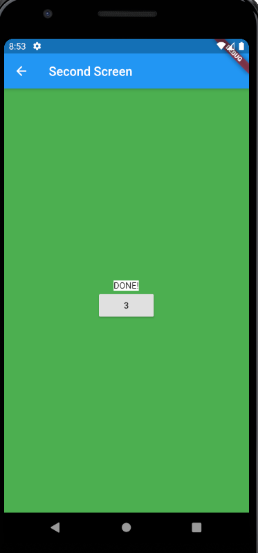

Multiple screen project

This app has 2 screen where the background color of the second screen changes according to the following

On input if the number mod 3 is
= 1 then blue screen and display number
= 2 then red screen and display the number in words
= 0 then green screen and display the number with white background and a text "DONE" with black background

Below are screenshots of the app

