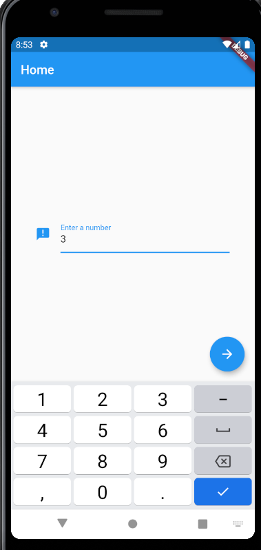
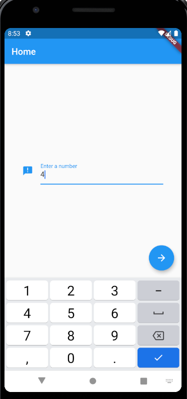
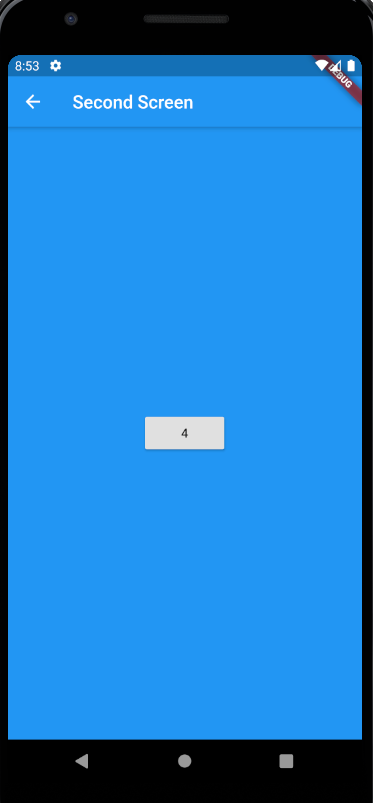
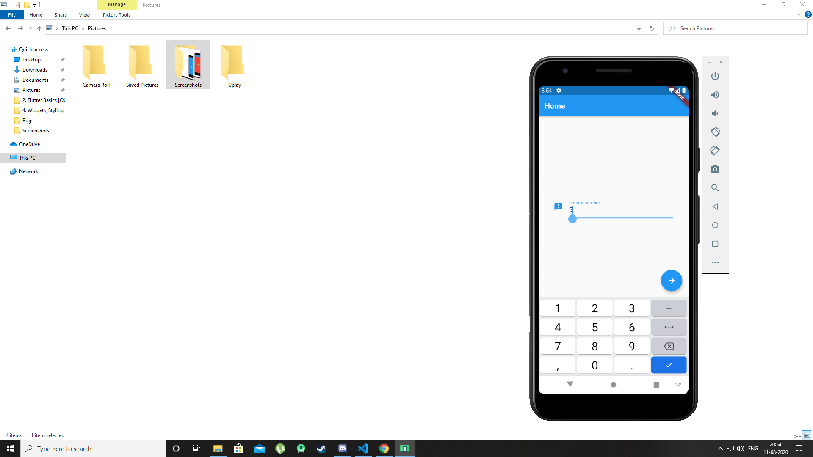

Multiple screen project

This app has 2 screen where the background color of the second screen changes according to the number provided. If the user enters a number and mod 3 is 0, 1 and 2 then the backfound color changes to green, blue and red respectively.

Below are screenshots of the app

